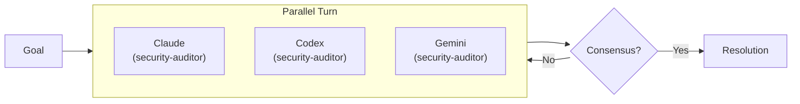
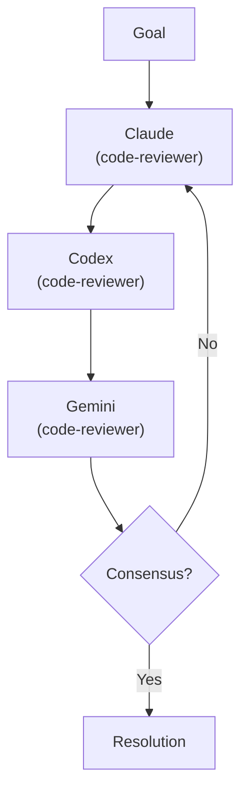
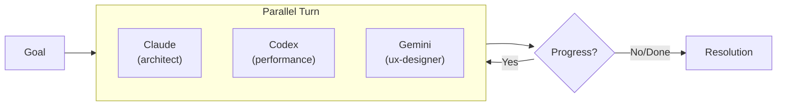
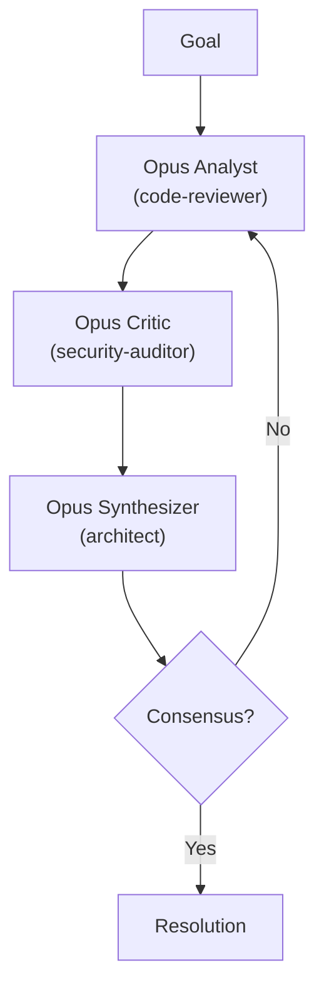
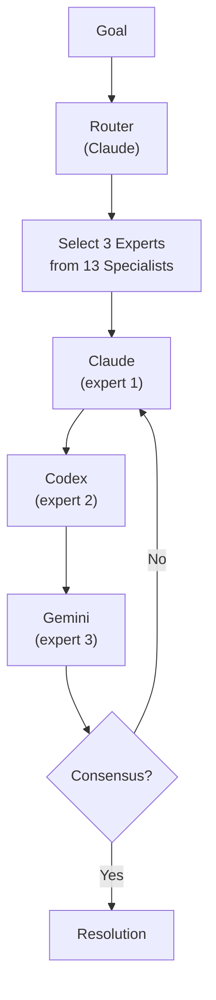
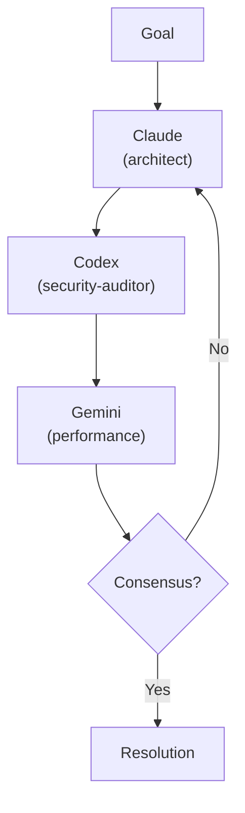
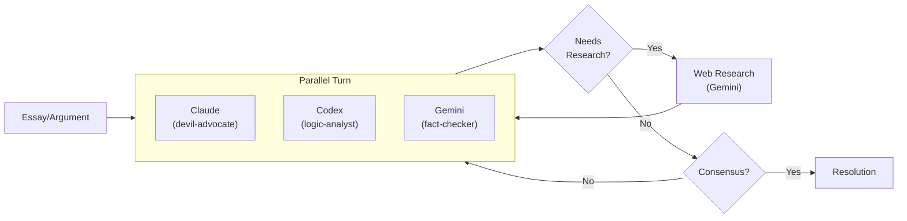
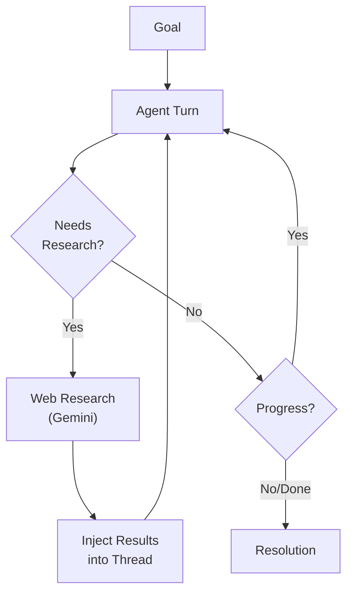
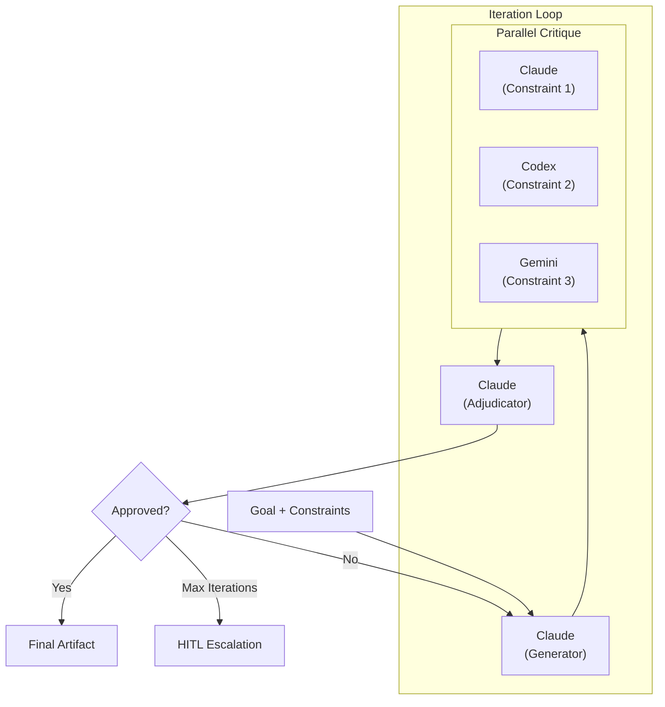

# Arena Profiles

Configuration presets that bundle mode, pattern, personas, and settings into reusable workflows.

## Usage

```bash
# Via Claude Code skill (recommended)
/arena:run "Review auth module" -p security-audit

# Direct invocation (plugin path)
python3 ${CLAUDE_PLUGIN_ROOT}/scripts/triad.py \
  --config ${CLAUDE_PLUGIN_ROOT}/config/triad.config.json \
  --name my-review -p security-audit

# CLI flags override profile settings
python3 ${CLAUDE_PLUGIN_ROOT}/scripts/triad.py --name my-review -p code-review --turns 10
```

---

## security-audit

Adversarial parallel analysis with security-focused personas.



**Settings:**
- Mode: adversarial
- Pattern: parallel
- Turns: 4
- Stop on consensus: true

---

## code-review

Standard sequential code review with turn-taking discussion.



**Settings:**
- Mode: adversarial
- Pattern: sequential
- Turns: 3
- Stop on consensus: true

---

## brainstorm

Collaborative parallel exploration with diverse expert perspectives.



**Settings:**
- Mode: collaborative
- Pattern: parallel
- Turns: 6
- Stop on stagnation: true

---

## opus-deep

Deep analysis using three Claude Opus 4.5 instances with different perspectives.



**Settings:**
- Mode: adversarial
- Pattern: sequential
- Turns: 6
- Agents: 3x Claude Opus 4.5
- Stop on consensus: true

---

## multi-expert (Dynamic Routing)

Intelligent expert selection based on your goal. The router analyzes your goal and automatically selects the 3 best experts from a pool of 13 specialists.



**Settings:**
- Mode: collaborative
- Pattern: sequential
- Turns: 6
- Routing: **enabled** (auto-selects experts)
- Stop on consensus: true

**Available Experts (13):**
`agent-architect`, `architect`, `langchain-expert`, `python-expert`, `backend-engineer`, `security-auditor`, `performance-engineer`, `testing-engineer`, `devops-engineer`, `ml-engineer`, `data-engineer`, `code-reviewer`, `ux-designer`

---

## static-expert

Fixed expert panel with architect, security, and performance perspectives (no dynamic routing).



**Settings:**
- Mode: collaborative
- Pattern: sequential
- Turns: 6
- Stop on consensus: true

---

## argument-review

Adversarial review of presentations, essays, and arguments with research-backed fact checking.



**Settings:**
- Mode: adversarial
- Pattern: parallel
- Turns: 4
- Enable research: true
- Research agent: gemini
- Stop on consensus: true

**Personas:**
- `devil-advocate`: Challenges assumptions, steelmans counterarguments
- `logic-analyst`: Checks reasoning structure, identifies fallacies
- `fact-checker`: Verifies claims, requests research for disputed facts

---

## research-brainstorm

Sequential brainstorm with integrated web research. Agents can request research mid-conversation.



**Settings:**
- Mode: collaborative
- Pattern: sequential
- Turns: 12
- Enable research: true
- Research agent: gemini
- Stop on stagnation: true

**Research Flow:**
1. Agent sets `status: "needs_research"` with `research_topics: ["topic1", "topic2"]`
2. Orchestrator runs web research via Gemini
3. Results are injected into the conversation thread
4. Next agent turn continues with research context

---

## Creating Custom Profiles

Create a JSON file in `~/.arena/profiles/` or `.arena/profiles/`:

```json
{
  "description": "My custom profile",
  "mode": "collaborative",
  "pattern": "sequential",
  "turns": 6,
  "stop_on_consensus": true,
  "enable_research": false,
  "order": ["claude", "codex", "gemini"],
  "agents": {
    "claude": {"kind": "claude", "cmd": ["claude", "-p", "--max-turns", "1"]}
  },
  "personas": {
    "claude": "architect",
    "codex": "code-reviewer",
    "gemini": "security-auditor"
  }
}
```

**Available Options:**
| Option | Type | Description |
|--------|------|-------------|
| `description` | string | Human-readable description |
| `mode` | string | `adversarial` or `collaborative` |
| `pattern` | string | `sequential` or `parallel` |
| `turns` | int | Number of turns |
| `routing` | bool | **Dynamic routing**: auto-select experts based on goal |
| `stop_on_consensus` | bool | Stop when agents agree |
| `stop_on_stagnation` | bool | Stop if no progress |
| `enable_research` | bool | Allow `needs_research` status |
| `research_agent` | string | Agent to use for research |
| `order` | array | Agent execution order |
| `agents` | object | Agent configurations (overrides config) |
| `personas` | object | Persona assignments per agent (ignored if `routing: true`) |
| `phases` | object | **Multi-phase**: Phase configuration for reliable generation pattern |

---

## reliable-generation

Constraint-driven generation with iterative refinement loop: **Generate → Critique → Adjudicate → Refine**.



**Settings:**
- Pattern: multi-phase
- Max iterations: 3
- Termination: All constraints satisfied (no CRITICAL/HIGH issues)
- HITL escalation: Max iterations, thrashing, conflicting criticals

**Constraint File Format (YAML):**
```yaml
id: safety
priority: 1  # Lower = higher priority

summary: |
  Content must be safe. No unresolved fear scenarios.

rules:
  - id: no-unresolved-fear
    text: "Fear scenarios must resolve within the scene."
    default_severity: CRITICAL
    examples:
      violation: "Child lost in dark forest, scene ends"
      compliant: "Child feels scared but finds way home"
```

**Directory Structure:**
```
.arena/runs/<name>/
├── goal.md                      # What to generate (required)
├── source.md                    # Source material (optional)
├── constraints/                 # User-authored constraint files
│   ├── safety.yaml
│   ├── tone.yaml
│   └── structure.yaml
├── .cache/                      # Auto-generated (gitignored)
│   └── constraints-compressed.md
├── iterations/                  # Phase outputs per iteration
│   ├── 1/
│   │   ├── artifact.md
│   │   ├── critiques/
│   │   │   ├── safety-claude.json
│   │   │   └── tone-gemini.json
│   │   └── adjudication.yaml
│   └── 2/
│       └── ...
└── final/
    └── artifact.md              # Approved output
```

**Usage:**
```bash
# Create run with reliable-generation profile
python3 ~/.arena/triad.py --name story-gen -p reliable-generation

# Edit goal and add constraints
vim .arena/runs/story-gen/goal.md
vim .arena/runs/story-gen/constraints/safety.yaml

# Preview constraint routing without executing
python3 ~/.arena/triad.py --name story-gen -p reliable-generation --dry-run

# Run with custom max iterations
python3 ~/.arena/triad.py --name story-gen -p reliable-generation --max-iterations 5
```

---

## Multi-Phase Profile Options

For `pattern: "multi-phase"` profiles, additional options are available:

| Option | Type | Description |
|--------|------|-------------|
| `phases.generate.agent` | string | Agent to use for generation (default: claude) |
| `phases.critique.agents` | array | Agents for critique phase (default: all 3) |
| `phases.critique.routing` | string | `all-to-all` (every agent reviews every constraint) |
| `phases.adjudicate.agent` | string | Agent for adjudication (default: claude) |
| `phases.refine.max_iterations` | int | Max refinement iterations (default: 3) |
| `termination.approve_when` | string | Approval condition (default: `no_critical_and_no_high`) |
| `termination.escalate_on` | array | Events that trigger HITL (`max_iterations`, `thrashing`) |
